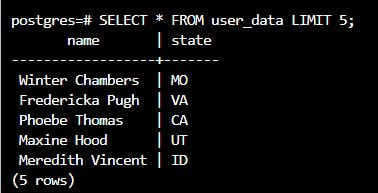

To see the preview in Atom, you have to tap ctrl+shift+m </br>
Exercices from Udacity SQL Nanodegree -> SQL aggregations  </br> </br> </br>




# Final Exercise: Data Manipulation


Due to some obscure privacy regulations, all users from California and New York must be removed from the data set.
```
\set AUTOCOMMIT off
ROLLBACK;
BEGIN;
SELECT * FROM "user_data" WHERE "state" = 'CA' OR "state" = 'NY';
DELETE FROM "user_data" WHERE "state" = 'CA' OR "state" = 'NY';
```
For the remaining users, we want to split up the name column into two new columns: first_name and last_name.
```
SELECT split_part("name", ' ', 1) FROM "user_data" LIMIT 5;

SELECT split_part("name", ' ', 2) FROM "user_data" LIMIT 5;

ALTER TABLE "user_data"
ADD COLUMN "first_name"  VARCHAR,
ADD COLUMN "last_name" VARCHAR;

UPDATE "user_data"
SET
"first_name" = split_part("name", ' ', 1),
"last_name" = split_part("name", ' ', 2);

SELECT * FROM "user_data" LIMIT 5;

```
Finally, we want to simplify the data by changing the state column to a state_id column.
First create a states table with an automatically generated id and state abbreviation.
Then, migrate all the states from the dataset to that table, taking care to not have duplicates.
Once all the states are migrated and have their unique ID, add a state_id column to the user_data table.
```
CREATE TABLE "states" (
  "state_id" SERIAL,
  "state" VARCHAR(2)
  );

INSERT INTO "states" ("state")
SELECT DISTINCT "state" FROM "user_data";

SELECT * FROM "states" ORDER BY "state" LIMIT 25;


ALTER TABLE "user_data"
ADD COLUMN "state_id" INT;

SELECT * FROM "user_data" LIMIT 5;


SELECT  "s"."state_id" FROM "states" "s", "user_data" "u"
WHERE "s"."state" = "u"."state"
LIMIT 5;

UPDATE user_data   
SET
  state_id = states.state_id
FROM states
WHERE states.state = user_data.state;


SELECT * FROM "user_data" LIMIT 5;

ALTER TABLE "user_data"
DROP COLUMN "state";

SELECT * FROM "user_data" LIMIT 5;
SELECT * FROM "states" LIMIT 5;

COMMIT;
\set AUTOCOMMIT on
SELECT * FROM "state" LIMIT 5;

SELECT * FROM "user_data" LIMIT 5;
SELECT * FROM "states" LIMIT 5;
```

Alternative update


```
UPDATE "user_data"
SET "state_id" = (
  SELECT "s"."state_id" FROM "states" "s"
  WHERE "s"."state" = "user_data"."state"
  );

```
