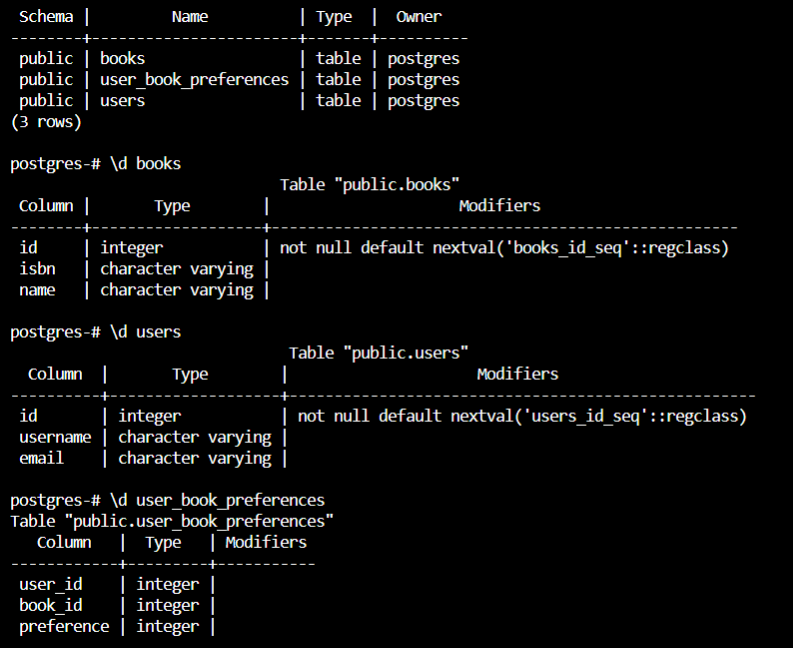

To see the preview in Atom, you have to tap ctrl+shift+m </br>
Exercices from Udacity SQL Nanodegree -> SQL aggregations  </br> </br> </br>




# Constraints CHECK, FOREIGN KEY, PRIMARY KEY

__1.__ Identify the primary key for each table
```
ALTER TABLE "books"
ADD PRIMARY KEY ("id"),
ADD UNIQUE ("name"),
ADD UNIQUE ("isbn");

ALTER TABLE "users"
ADD PRIMARY KEY ("id");

ALTER TABLE "user_book_preferences"
ADD PRIMARY KEY ("user_id", "book_id");
```

__2.__ Identify the unique constraints necessary for each table
```
ALTER TABLE "books" ADD
UNIQUE ("isbn");
```

__3.__Identify the foreign key constraints necessary for each table
```
ALTER TABLE "user_book_preferences" 
ADD FOREIGN KEY ("user_id")
REFERENCES "users" ("id") ON DELETE CASCADE; 

ALTER TABLE "user_book_preferences" 
ADD FOREIGN KEY ("book_id")
REFERENCES "books" ("id") ON DELETE CASCADE; 
```

__4.__In addition to the three types of constraints above, you'll have to implement some custom business rules:
* Usernames need to have a minimum of 5 characters\
```
ALTER TABLE "users" ADD
CHECK (LENGTH(TRIM("username")) >=5);
```
* A book's name cannot be empty
```
ALTER TABLE "books" ADD
CHECK (LENGTH(TRIM("name")) >0);
```
* A book's name must start with a capital letter
```
ALTER TABLE "books" ADD
CHECK (UPPER(LEFT(name,1))=LEFT(name,1));
```
* A user's book preferences have to be distinct
```
ALTER TABLE "user_book_preferences" ADD
UNIQUE ("user_id","preference");
```
