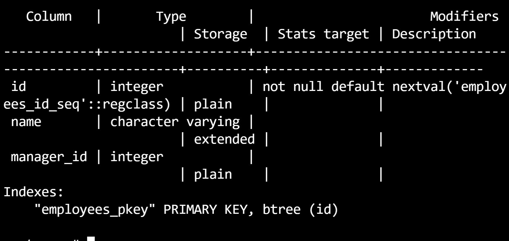
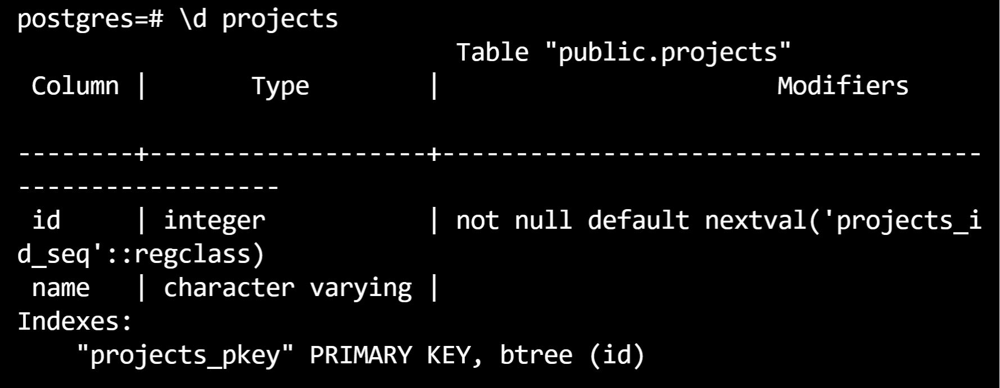
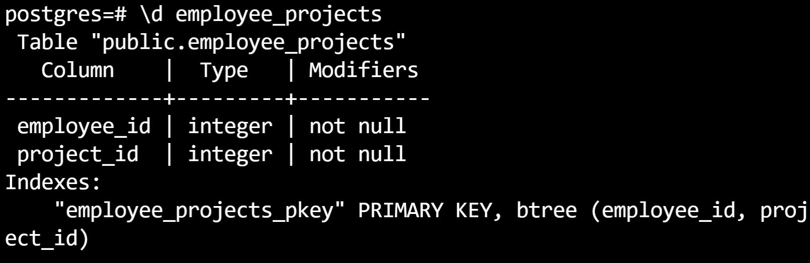

To see the preview in Atom, you have to tap ctrl+shift+m </br>
Exercices from Udacity SQL Nanodegree -> SQL aggregations  </br> </br> </br>


__employees table__


__projects table__


__employee_project table__



# Foreign Key Constraints

__A.__ When an employee who's a manager gets deleted from the system, we want to keep all the employees that were under him/her. They simply won't have a manager assigned to them.

```
ALTER TABLE "employees" ADD
FOREIGN KEY ("manager_id")
REFERENCES "employees" ("id") ON DELETE SET NULL;
```

__B.__ We can't delete an employee as long as they have projects assigned to them.
```
ALTER TABLE "employee_projects"
ADD CONSTRAINT "delete_employee_no_projects"
FOREIGN KEY ("project_id")
REFERENCES "projects" ("id") ON DELETE RESTRICT;
```
