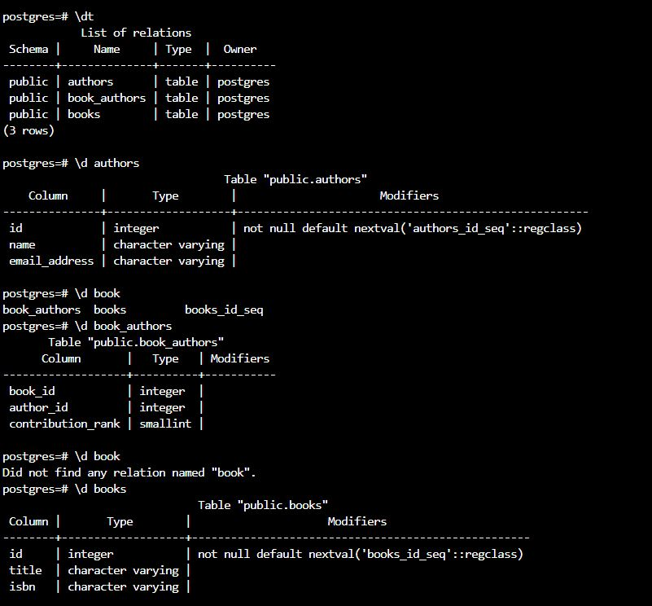

d
To see the preview in Atom, you have to tap ctrl+shift+m </br>
Exercices from Udacity SQL Nanodegree -> SQL aggregations  </br> </br> </br>




# Unique & Primary Key Constraints

For this exercise, you're going to have to explore the data schema in the Postgres workspace in order to determine which pieces of data require Unique and Primary Key constraints. Then, you'll have to execute the appropriate ALTER TABLE statements to add these constraints to the data set.

__authors table__
```
ALTER TABLE "authors" ADD PRIMARY KEY ("id");
ALTER TABLE "authors" ADD CONSTRAINT "unique_email" UNIQUE ("email_address");
```

__book table__
```
ALTER TABLE "books" ADD CONSTRAINT "primary_key_book_id" PRIMARY KEY ("id");
ALTER TABLE "books" ADD CONSTRAINT "isbn_unique" UNIQUE ("isbn");
```

__book_authors table__
```
ALTER TABLE "books" ADD CONSTRAINT "primary_key_book_id" PRIMARY KEY ("id");
ALTER TABLE "books" ADD CONSTRAINT "isbn_unique" UNIQUE ("isbn");
```
