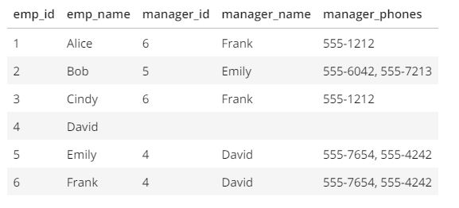

To see the preview in Atom, you have to tap ctrl+shift+m </br>
Exercices from Udacity SQL Nanodegree -> SQL DDL  </br> </br> </br>




# CREATE  exercices


```
CREATE TABLE "employees" ("id" ID,"emp_name" text,"manager_id" int,"manager_name" text,"manager_phones" text);

CREATE TABLE "employees" (
  "id" SERIAL,
  "emp_name" TEXT,
  "manager_id" INTEGER
  );

  CREATE TABLE "managers"
  (
    "manager_id" SERIAL,
    "manager_name" TEXT,
    "phone_number" TEXT
  );
```
