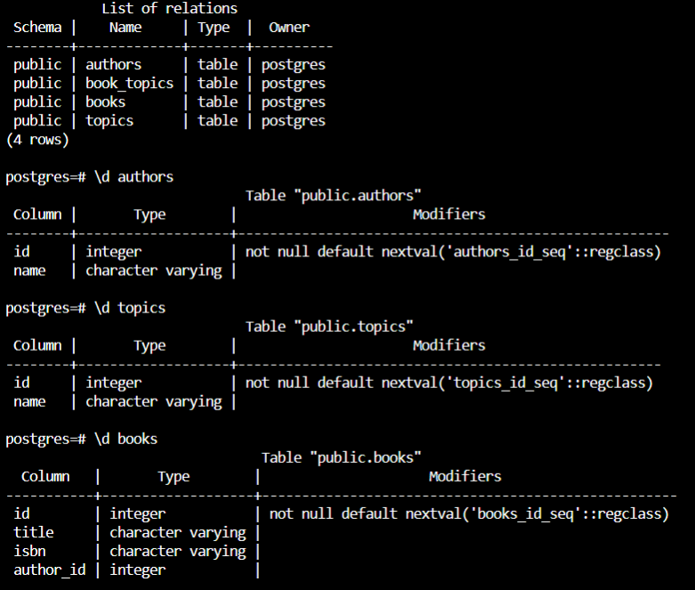
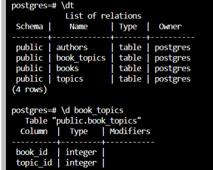

To see the preview in Atom, you have to tap ctrl+shift+m </br>
Exercices from Udacity SQL Nanodegree -> SQL aggregations  </br> </br> </br>






# Indexing at sql

__1.__ We need to be able to quickly find books and authors by their IDs. 
```
ALTER TABLE "authors" 
ADD PRIMARY KEY ("id");

ALTER TABLE "books"
ADD PRIMARY KEY ("id"),
ADD UNIQUE ("isbn"),
ADD FOREIGN KEY ("author_id") REFERENCES "authors" ("id");


ALTER TABLE "book_topics"
ADD PRIMARY KEY ("book_id", "topic_id");

ALTER TABLE "topics"
ADD PRIMARY KEY ("id"),
ADD UNIQUE ("name"),
ALTER COLUMN "name" SET  NOT NULL;
```
__2.__ We need to be able to quickly tell which books an author has written.
```
ALTER TABLE "books" 

```
__3.__ We need to be able to quickly find a book by its ISBN #.
```
CREATE INDEX "quickISBN" ON "books"
(
    "isbn"
);
```


We need to be able to quickly search for books by their titles in a case-insensitive way, even if the title is partial. For example, searching for "the" should return "The Lord of the Rings".
For a given book, we need to be able to quickly find all the topics associated to it.
For a given topic, we need to be able to quickly find all the books tagged with it.