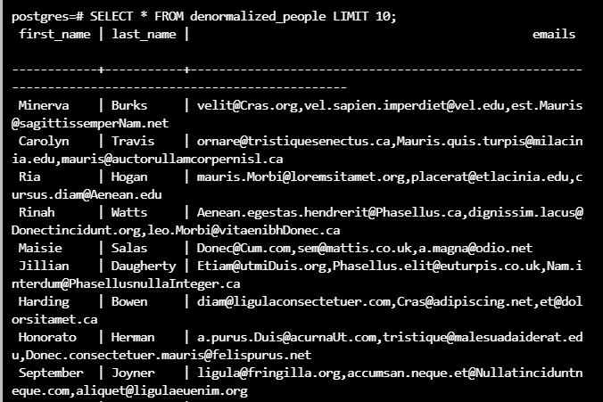

To see the preview in Atom, you have to tap ctrl+shift+m </br>
Exercices from Udacity SQL Nanodegree -> SQL DDL  </br> </br> </br>



# Exercise: Inserting Data in Postgres
  exercices


In a first step, you'll have to migrate the list of people without their emails into the normalized people table, which contains an id SERIAL column in addition to first_name and last_name.

```
INSERT INTO "people" ("first_name", "last_name")
SELECT "first_name", "last_name" FROM "denormalized_people";
```
```
INSERT INTO "people" ("first_name", "last_name")
  SELECT "first_name", "last_name" FROM "denormalized_people";
```

```
SELECT first_name, last_name,
    REGEXP_SPLIT_TO_TABLE(emails, ',')
 FROM denormalized_people;
```
