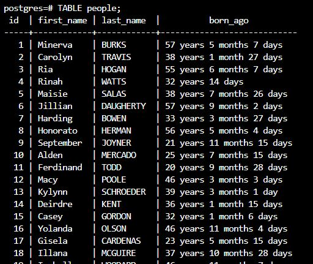

To see the preview in Atom, you have to tap ctrl+shift+m </br>
Exercices from Udacity SQL Nanodegree -> SQL aggregations  </br> </br> </br>




# Exercise: Updating Data in Postgres


All values of the last_name column are currently in upper-case. We'd like to change them from e.g. "SMITH" to "Smith". Using an UPDATE query and the right string function(s), make that happen.

```
UPDATE "people"
SET
  "last_name" = LEFT("last_name",1) || LOWER(SUBSTR("last_name",2,LENGTH("last_name")));
```


Instead of dates of birth, the table has a column born_ago, a TEXT field of the form e.g. '34 years 5 months 3 days'. We'd like to convert this to an actual date of birth. In a first step, use the appropriate DDL command to add a date_of_birth column of the appropriate data type. Then, using an UPDATE query, set the date_of_birth column to the correct value based on the value of the born_ago column. Finally, using another DDL command, remove the born_ago column from the table

```
ALTER TABLE "people"
ADD COLUMN "date_of_birth" DATE;

UPDATE "people"
SET
  "date_of_birth" = (CURRENT_TIMESTAMP - "born_ago"::INTERVAL)::DATE;

ALTER TABLE "people"
DROP COLUMN "born_ago";
```
