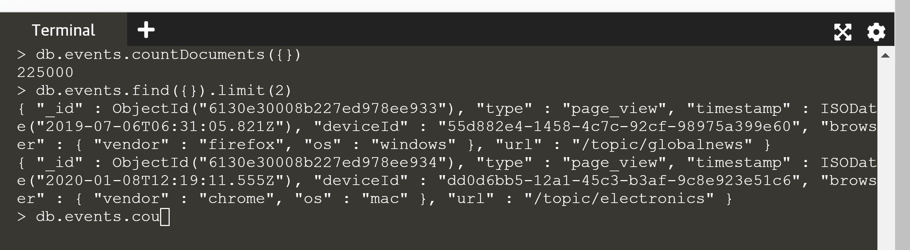
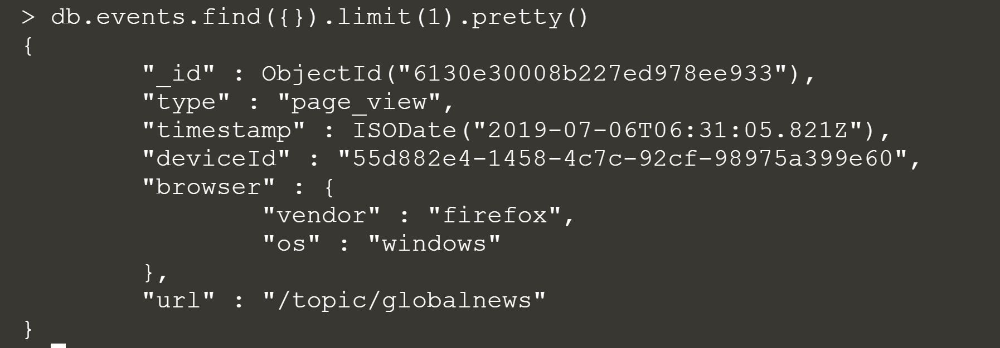
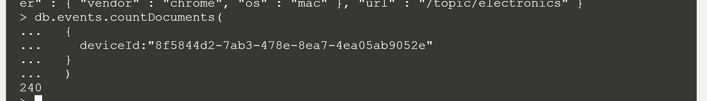
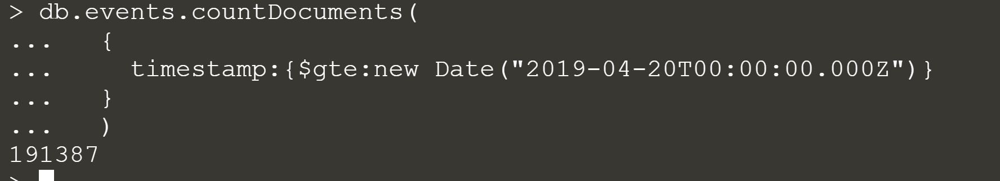

d
To see the preview in Atom, you have to tap ctrl+shift+m </br>
Exercices from Udacity SQL Nanodegree -> SQL aggregations  </br> </br> </br>





# MongoDB of the section

Then, write the appropriate queries to retrieve the following:

__1.__ The total number of events in the collection

```
db.events.countDocuments({})
```
__2.__ The total number of events for the device with ID 8f5844d2-7ab3-478e-8ea7-4ea05ab9052e
```
db.events.countDocuments(
  {
    deviceId:"8f5844d2-7ab3-478e-8ea7-4ea05ab9052e"
  }
  )
```

__3.__ The total number of events that came from a Firefox browser and happened on or after April 20th, 2019
```
db.events.countDocuments(
  {
    timestamp:{$gte:new Date("2019-04-20T00:00:00.000Z")}
  }
  )
```

__4.__ The list of the top 100 events that happened in Chrome on Windows, sorted in reverse chronological order
