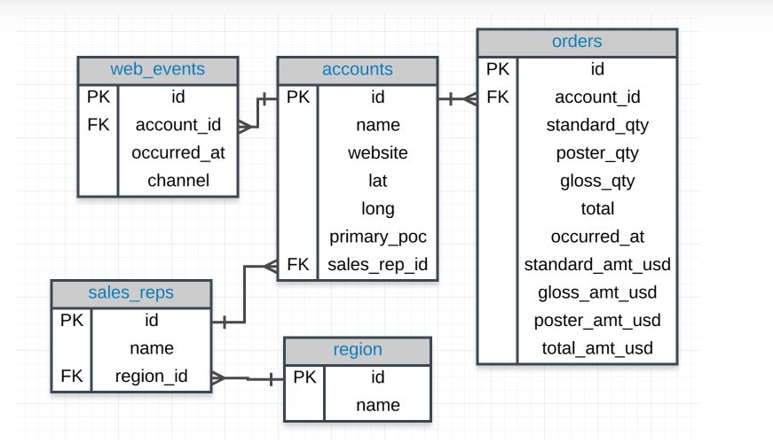

To see the preview in Atom, you have to tap ctrl+shift+m </br>
Exercices from Udacity SQL Nanodegree -> SQL aggregations  </br> </br> </br>




# GROUP BY exercices

Which account (by name) placed the earliest order? Your solution should have the account name and the date of the order.
```
SELECT a.name, o.occurred_at
FROM accounts a
JOIN orders o
ON a.id = o.account_id
ORDER BY occurred_at
LIMIT 1;
```
Find the total sales in usd for each account. You should include two columns - the total sales for each company's orders in usd and the company name.
```
SELECT name, SUM(total_amt_usd) total_sales!
FROM accounts a
JOIN orders o
ON a.id = o.account_id
GROUP BY name;
```
Via what channel did the most recent (latest) web_event occur, which account was associated with this web_event? Your query should return only three values - the date, channel, and account name.
```
SELECT w.occurred_at date, a.name, w.channel
FROM web_events w
JOIN accounts a ON a.id = w.account_id
ORDER BY date DESC
LIMIT 1;

```
Find the total number of times each type of channel from the web_events was used. Your final table should have two columns - the channel and the number of times the channel was used.
```
SELECT  w.channel, COUNT(*) nb_of_times
FROM web_events w
GROUP BY w.channel
ORDER BY nb_of_times DESC
```
Who was the primary contact associated with the earliest web_event?
```
SELECT a.primary_poc,w.occurred_at date
FROM web_events w
JOIN accounts a ON a.id = w.account_id
ORDER BY date DESC
LIMIT 1;
```
What was the smallest order placed by each account in terms of total usd. Provide only two columns - the account name and the total usd. Order from smallest dollar amounts to largest.
```
SELECT a.name, MIN(total_amt_usd ) smallest_order
FROM orders o
JOIN accounts a
ON a.id = o.account_id
GROUP BY a.name
ORDER BY smallest_order
LIMIT 1;
```
Find the number of sales reps in each region. Your final table should have two columns - the region and the number of sales_reps. Order from fewest reps to most reps.
```
SELECT r.name, count(*)
FROM sales_reps s
JOIN region r
ON s.region_id = r.id
GROUP BY r.name
```
