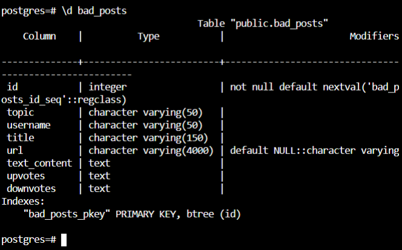

To see the preview in Atom, you have to tap ctrl+shift+m </br>
Exercices from Udacity SQL Nanodegree -> project  </br> </br> </br>





# Project: Udiddit


## Project Workspace
Accompanying this document is a SQL Workspace, which contains a dump of all the current data Udiddit has been gathering. You’ll be able to use this workspace to test your queries against real-life data. There are two important things you need to know about this SQL Workspace:

The workspace will reset changes to the database after fifteen (15) minutes of being closed/inactive. It will only store a limited amount of your previous queries in the history bar at the top, so make sure to save your queries down outside of the workspace before you leave.
Some queries involving large amounts of data can take up to 10-15 seconds to execute.
The data is also attached at the bottom of this page in bad_db.sql if you'd like to use it outside of the workspace.

## Project Rubric
Following the tasks in the Google Docs template should get you to a fully functioning project, but make sure to double-check your work against the requirements in the project rubric as well before you submit on the last page in this lesson.


### Part I: Investigate the existing schema
As a first step, investigate this schema and some of the sample data in the project’s SQL workspace. Then, in your own words, outline three (3) specific things that could be improved about this schema. Don’t hesitate to outline more if you want to stand out!
__bad_comments table__
```
In the bad_comments table, users should be referenced with a FOREIGN KEY CONSTRAINT that references ids of users.
The post_id column shoud have a FOREIGN KEY CONSTRAINT associated with it that references ids of posts table.
Comments usually are limited to a certain number of caracters. Thus, the "text_content" column may be a VARCHAR with a concrete number of
caracters.
```
__bad_posts table__
```
In the bad_posts table, users should be referenced with a FOREIGN KEY CONSTRAINT that references ids of users.
The post_id column shoud have a FOREIGN KEY CONSTRAINT associated with it that references ids of posts table.
The columns "upvotes" and "downvotes"  should be probably INTEGER datatype.
```
__Conculsions__
'''
Users table should be created.
'''