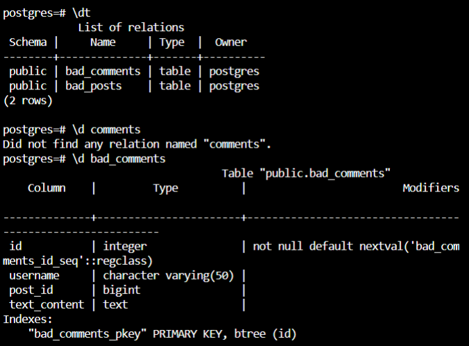

To see the preview in Atom, you have to tap ctrl+shift+m </br>
Exercices from Udacity SQL Nanodegree -> project  </br> </br> </br>





# Project: Udiddit

````
CREATE TABLE bad_posts (
	id SERIAL PRIMARY KEY,
	topic VARCHAR(50),
	username VARCHAR(50),
	title VARCHAR(150),
	url VARCHAR(4000) DEFAULT NULL,
	text_content TEXT DEFAULT NULL,
	upvotes TEXT,
	downvotes TEXT
);

CREATE TABLE bad_comments (
	id SERIAL PRIMARY KEY,
	username VARCHAR(50),
	post_id BIGINT,
	text_content TEXT
);

````


## Project Workspace
Accompanying this document is a SQL Workspace, which contains a dump of all the current data Udiddit has been gathering. You’ll be able to use this workspace to test your queries against real-life data. There are two important things you need to know about this SQL Workspace:

The workspace will reset changes to the database after fifteen (15) minutes of being closed/inactive. It will only store a limited amount of your previous queries in the history bar at the top, so make sure to save your queries down outside of the workspace before you leave.
Some queries involving large amounts of data can take up to 10-15 seconds to execute.
The data is also attached at the bottom of this page in bad_db.sql if you'd like to use it outside of the workspace.

## Project Rubric
Following the tasks in the Google Docs template should get you to a fully functioning project, but make sure to double-check your work against the requirements in the project rubric as well before you submit on the last page in this lesson.


### Part I: Investigate the existing schema
As a first step, investigate this schema and some of the sample data in the project’s SQL workspace. Then, in your own words, outline three (3) specific things that could be improved about this schema. Don’t hesitate to outline more if you want to stand out!
__bad_comments table__
```
In the bad_comments table, users should be referenced with a FOREIGN KEY CONSTRAINT that references ids of users.
The post_id column shoud have a FOREIGN KEY CONSTRAINT associated with it that references ids of posts table.
Comments usually are limited to a certain number of caracters. Thus, the "text_content" column may be a VARCHAR with a concrete number of
caracters.
```
__bad_posts table__
```
In the bad_posts table, users should be referenced with a FOREIGN KEY CONSTRAINT that references ids of users.
The post_id column shoud have a FOREIGN KEY CONSTRAINT associated with it that references ids of posts table.
The columns "upvotes" and "downvotes"  should be probably INTEGER datatype.
```
__Conculsions__
```
Users table should be created.
```

### Part II: Create the DDL for your new schema


__1.__ Guideline #1: here is a list of features and specifications that Udiddit needs in order to support its website and administrative interface:<br/><br/>
__a.__  Allow new users to register:<br/>
    * Each username has to be unique<br/>
    * Usernames can be composed of at most 25 characters<br/>
    * Usernames can’t be empty<br/>
    * We won’t worry about user passwords for this project<br/>
```
CREATE TABLE "users"
(
    "id" SERIAL PRIMARY KEY,
    "username" VARCHAR(100) NOT NULL,
    CONSTRAINT "valid_not_empy_username" CHECK (LENGTH(TRIM("username""))>0)
);
-- enforcing uniqueness on "username" column
CREATE UNIQUE INDEX "username_unique_caseinsensitive" ON "users"
(
    LOWER("username")
);  
```
 
__b.__  Allow registered users to create new topics:<br/>
    * Topic names have to be unique.<br/>
    * The topic’s name is at most 30 characters<br/>
    * The topic’s name can’t be empty<br/>
    * Topics can have an optional description of at most 500 characters.<br/>
        
```
CREATE TABLE "topics"
(
    "id" SERIAL PRIMARY KEY,
    "topics" VARCHAR(30) UNIQUE NOT NULL,
    "description" VARCHAR(500)
);
```

__c.__ Allow registered users to create new posts on existing topics:<br/>
    * Posts have a required title of at most 100 characters<br/>
    * The title of a post can’t be empty.<br/>
    * Posts should contain either a URL or a text content, but not both.<br/>
    * If a topic gets deleted, all the posts associated with it should be automatically deleted too.<br/>
    * If the user who created the post gets deleted, then the post will remain, but it will become dissociated from that user.<br/>
```
CREATE TABLE posts (
	id SERIAL PRIMARY KEY,
	topic_id INTEGER REFERENCES "topics" ON DELETE CASCADE,
	user_id INTEGER REFERENCES "users" ON DELETE SET NULL,
	title VARCHAR(100) NOT NULL,
	url VARCHAR(4000),
	text_content TEXT,
	upvotes INTEGER,
	downvotes INTEGER,
    CONSTRAINT "title_is_not_empty" CHECK (LENGHT(TRIM("title")) > 0)
);


ALTER TABLE "posts"
ADD CONSTRAINT "either_URL_or_text_content"
CHECK
(
    ((LENGHT(TRIM("url")) = 0 OR
    "url" IS NULL) AND 
    (LENGHT(TRIM("text_content")) > 0 OR
    "text_content" IS NOT NULL)) OR
    ((LENGHT(TRIM("text_content")) = 0 OR
    "text_content" IS NULL) AND 
    (LENGHT(TRIM("url")) > 0 OR
    "url" IS NOT NULL))
)

```
__d.__ Allow registered users to comment on existing posts:</br>
    * A comment’s text content can’t be empty.
    * Contrary to the current linear comments, the new structure should allow comment threads at arbitrary levels.<br/>
    * If a post gets deleted, all comments associated with it should be automatically deleted too.<br/>
    * If the user who created the comment gets deleted, then the comment will remain, but it will become dissociated from that user.<br/>
    * If a comment gets deleted, then all its descendants in the thread structure should be automatically deleted too.<br/>
```

```
__e.__ Make sure that a given user can only vote once on a given post:<br/>
    * Hint: you can store the (up/down) value of the vote as the values 1 and -1 respectively.<br/>
    * If the user who cast a vote gets deleted, then all their votes will remain, but will become dissociated from the user.<br/>
    * If a post gets deleted, then all the votes for that post should be automatically deleted too.<br/>
```

```