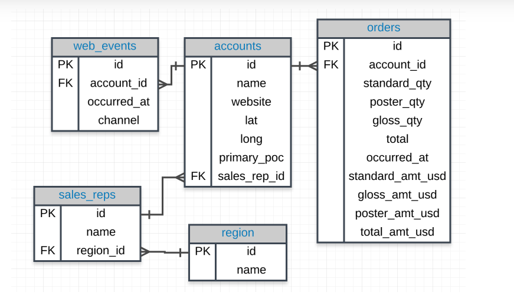

To see the preview in Atom, you have to tap ctrl+shift+m



# Exericice 1
Provide a table that provides the region for each sales_rep along with their associated accounts.
This time only for the Midwest region. Your final table should include three columns: the region name, the sales rep name,
and the account name. Sort the accounts alphabetically (A-Z) according to account name.


```
SELECT
   r.name region_name,
	   s.name sales_name,
   a.name account_name
 FROM region r
 JOIN sales_reps s ON r.id = s.region_id
 JOIN accounts a ON a.sales_rep_id = s.id
```

# Exercice 2
Provide a table that provides the region for each sales_rep along with their associated accounts. This time only for accounts where the sales rep has a first name starting with S and in the Midwest region. Your final table should include three columns: the region name, the sales rep name, and the account name. Sort the accounts alphabetically (A-Z) according to account name.

```
SELECT
 r.name region_name,
     s.name sales_name,
 a.name account_name
FROM region r
JOIN sales_reps s ON r.id = s.region_id
JOIN accounts a ON a.sales_rep_id = s.id
WHERE s.name LIKE 'S%' AND r.name = 'Midwest'
ORDER BY account_name
```

# Exericice 3
Provide a table that provides the region for each sales_rep along with their associated accounts. This time only for accounts where the sales rep has a last name starting with K and in the Midwest region. Your final table should include three columns: the region name, the sales rep name, and the account name. Sort the accounts alphabetically (A-Z) according to account name.
```
SELECT
 r.name region_name,
     s.name sales_name,
 a.name account_name
FROM region r
JOIN sales_reps s ON r.id = s.region_id
JOIN accounts a ON a.sales_rep_id = s.id
WHERE s.name LIKE '% K%' AND r.name = 'Midwest'
ORDER BY account_name
```

# Exercice 4
Provide the name for each region for every order, as well as the account name and the unit price they paid (total_amt_usd/total) for the order. However, you should only provide the results if the standard order quantity exceeds 100. Your final table should have 3 columns: region name, account name, and unit price. In order to avoid a division by zero error, adding .01 to the denominator here is helpful total_amt_usd/(total+0.01).
```
SELECT
 r.name region_name,
 a.name account_name,
 o.total_amt_usd/(o.total + 0.0001) unit_price
FROM region r
JOIN sales_reps s ON r.id = s.region_id
JOIN accounts a ON a.sales_rep_id = s.id
JOIN orders o ON a.id = o.account_id
```


# Exercice 5
Provide the name for each region for every order, as well as the account name and the unit price they paid (total_amt_usd/total) for the order. However, you should only provide the results if the standard order quantity exceeds 100 and the poster order quantity exceeds 50. Your final table should have 3 columns: region name, account name, and unit price. Sort for the smallest unit price first. In order to avoid a division by zero error, adding .01 to the denominator here is helpful (total_amt_usd/(total+0.01).
```
SELECT
 r.name region_name,
 a.name account_name,
 o.total_amt_usd/(o.total + 0.0001) unit_price
FROM region r
JOIN sales_reps s ON r.id = s.region_id
JOIN accounts a ON a.sales_rep_id = s.id
JOIN orders o ON a.id = o.account_id
WHERE o.standard_qty > 100
AND  o.poster_qty >50
```
